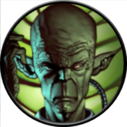

<!-- Improved compatibility of back to top link: See: https://github.com/othneildrew/Best-README-Template/pull/73 -->

<!--
*** Thanks for checking out the Best-README-Template. If you have a suggestion
*** that would make this better, please fork the repo and create a pull request
*** or simply open an issue with the tag "enhancement".
*** Don't forget to give the project a star!
*** Thanks again! Now go create something AMAZING! :D
-->

<!-- PROJECT SHIELDS -->
<!--
*** I'm using markdown "reference style" links for readability.
*** Reference links are enclosed in brackets [ ] instead of parentheses ( ).
*** See the bottom of this document for the declaration of the reference variables
*** for contributors-url, forks-url, etc. This is an optional, concise syntax you may use.
*** https://www.markdownguide.org/basic-syntax/#reference-style-links
-->
[![Contributors][contributors-shield]][contributors-url]
[![Forks][forks-shield]][forks-url]
[![Stargazers][stars-shield]][stars-url]
[![Issues][issues-shield]][issues-url]
[![MIT License][license-shield]][license-url]

<!-- PROJECT LOGO -->
 

  

  <h3 align="center">Momir Basic</h3>

  

    A graphic interface to allow you to play Momir Basic in person.
  

<!-- TABLE OF CONTENTS -->

  
Table of Contents

  <ol>
    <li>
      <a href="#about-the-project">About The Project</a>
    </li>
    <li>
      <a href="#getting-started">Getting Started</a>
    </li>
    <li><a href="#usage">Usage</a></li>
    <li><a href="#contributing">Contributing</a></li>
    <li><a href="#license">License</a></li>
    <li><a href="#contact">Contact</a></li>
    <li><a href="#acknowledgments">Acknowledgments</a></li>
  </ol>

<!-- ABOUT THE PROJECT -->
## About The Project

I've always wanted to be able to play the Magic: The Gathering format Momir Basic in person, but it's an online only format and it wasn't really feasible to carry around that many cards with me.

This project will bring Momir to paper by connecting to your default printer (preferably a receipt printer) and giving you a graphic interface to print tokens from. Everything this produces is intended to be used as a token and does not try to be anything more than that.

(<a href="#readme-top">back to top</a>)

<!-- GETTING STARTED -->
## Getting Started

Currently this is only setup for windows, but to run the program you can either download the EXE from the releases or use python (I created this with Python 3.12.8) and run the main.py after installing the requirements from the requirements.txt

(<a href="#readme-top">back to top</a>)

<!-- USAGE EXAMPLES -->
## Usage

I will put stuff here

(<a href="#readme-top">back to top</a>)

<!-- CONTRIBUTING -->
## Contributing

If you have a suggestion that would make this better, please fork the repo and create a pull request. You can also simply open an issue with the tag "enhancement".

### Top contributors:

Made with [contrib.rocks](https://contrib.rocks).

(<a href="#readme-top">back to top</a>)

<!-- LICENSE -->
## License

Distributed under the MIT License. See `LICENSE.txt` for more information.

(<a href="#readme-top">back to top</a>)

<!-- CONTACT -->
## Contact

Mythic - [not_mythic](https://discordapp.com/users/187356367030452224) on Discord

Project Link: [https://github.com/MythicWebsite/momir](https://github.com/MythicWebsite/momir)

(<a href="#readme-top">back to top</a>)

<!-- ACKNOWLEDGMENTS -->
## Acknowledgments

Use this space to list resources you find helpful and would like to give credit to. I've included a few of my favorites to kick things off!

* [ReadMe Template](https://github.com/othneildrew/Best-README-Template)
* [FontSpace User Pixel Sagas](https://www.fontspace.com/planewalker-font-f18098)
* [Scryfall](https://scryfall.com)

(<a href="#readme-top">back to top</a>)

<!-- MARKDOWN LINKS & IMAGES -->
<!-- https://www.markdownguide.org/basic-syntax/#reference-style-links -->
[contributors-shield]: https://img.shields.io/github/contributors/MythicWebsite/momir.svg?style=for-the-badge
[contributors-url]: https://github.com/MythicWebsite/momir/graphs/contributors
[forks-shield]: https://img.shields.io/github/forks/MythicWebsite/momir.svg?style=for-the-badge
[forks-url]: https://github.com/MythicWebsite/momir/network/members
[stars-shield]: https://img.shields.io/github/stars/MythicWebsite/momir.svg?style=for-the-badge
[stars-url]: https://github.com/MythicWebsite/momir/stargazers
[issues-shield]: https://img.shields.io/github/issues/MythicWebsite/momir.svg?style=for-the-badge
[issues-url]: https://github.com/othneildrew/Best-README-Template/issues
[license-shield]: https://img.shields.io/github/license/MythicWebsite/momir.svg?style=for-the-badge
[license-url]: https://github.com/MythicWebsite/momir/blob/master/LICENSE.txt

